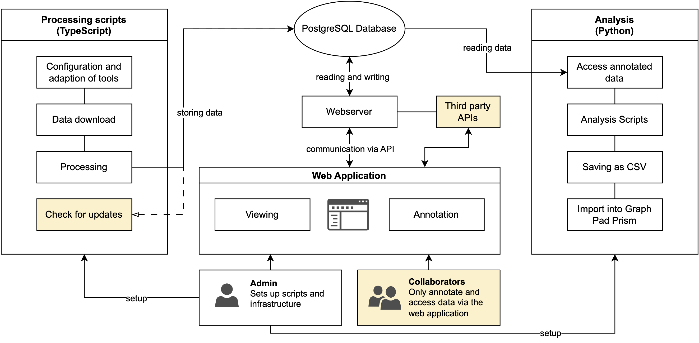

## Repurposing of H1-receptor antagonists (levo)cetirizine, (des)loratadine and fexofenadine as a case study for systematic analysis of trials on clinicaltrials.gov using semi-automated processes with custom-coded software

> **_‼️ Important information ‼️:_**  The version of the clinicaltrials API used in this repository [is no longer available](https://clinicaltrials.gov/data-api/about-api/api-migration)! We implemented a new work-in-progress version of the download script to support the legacy API provided by clinicaltrials.gov. Currently, only the `data/processing_add.ts` script is able to process data downloaded via the legacy API.

This repository includes the custom coded software corresponding to the paper with the title above. The software is split into three main components in individual directories (`./processing`, `./study-edit`, `./analysis`) which is explained in detail in the paper.



This version differs from the version used in the original paper (can still be accessed in the branch `original-version`). We modified this version to allow installation via docker and usage via a web browser so it may be used without installing every requirement individually.

## Instructional video

[[English Video] Basic installation and usage demonstration](https://youtu.be/IGoJE59g190)


[[German Video] Basic installation and usage demonstration](https://youtu.be/_msVKMROs80)

## Wiki

For additional resources regarding usage, common errors etc. you can have a look at [the project wiki](https://github.com/T-Specht/h1ra-repurpose/wiki).

## Prerequisites

For easy installation, the software components are packaged into Docker containers. Therefore, installation via **Docker** is recommended and requires Docker to be installed.

## Installation

1. Download the repository, e.g. using git

```
git clone https://github.com/T-Specht/h1ra-repurpose.git
```

2. Rename `example.env` to `.env`. You may configure the software here but for a normal local installation, the default values are most likely sufficient.
3. Download, build and start the docker containers using
```
docker compose up -d
```
4. Open `http://localhost/` in your browser to access the software components via a dashboard. We recommend the use of Chromium (e.g. Google Chrome).
5. Refer to the configuration and installation of the individual components below.

## Components

### ./processing: TypeScript scritps for data download, processing and database management

Install requirements using:
```
yarn install
yarn prisma migrate dev
```

- `data/api_download.ts`: downloads the newest study data to a temporary .json automatically named based on the current date
- `data/processing.ts`: processes the downloaded data after reading it from the .json file (needs to be adjusted to read the correct file)
- `data/processing.ts`: processes the downloaded data after reading it from the .json file (needs to be adjusted to read the correct file)
- `data/checkForUpdates.ts`: compares two .json files of downloaded data and references data stored in database

### ./study-edit: A next.js (t3) web app for editing and annotating the study data stored in a database

This should run out-of-the-box as soon as you have imported study data into the database using the processings scripts mentioned above. 

You may use the in-browser code editor provided for the processings scripts to open the folder `/home/study-edit` to customize the web application. Depending on the changes you make, you may need to rebuild the docker image.

### ./analysis

Please run the first few cells in order for the first time to ensure automatic installation of necessary software components.

The Jupyter notebook automatically exports the data as .csv files to the `./analysis/pvt/` directory. This data can then be imported into other software solutions like GraphPad Prism for more advanced graphical anaylsis.
